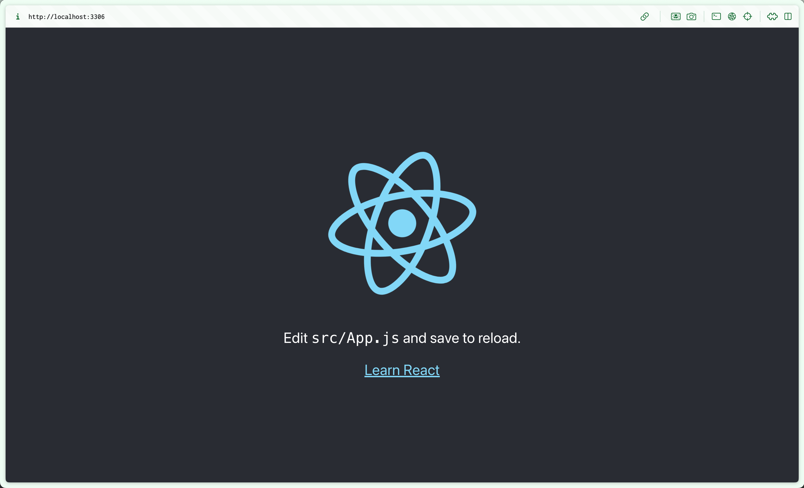
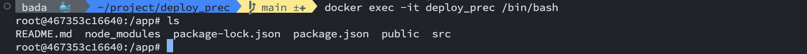

# Docker로 React 개발 및 배포하기 실습

## 1. Setting Docker Container

- hub.docker.com에서 node 이미지 사용
- 루트 디렉토리에 Dockerfile & .dockerignore 생성 후 작성

## 2. Build Docker Image

- `docker build -t react-docker .` 명령어로 이미지 빌드
  - `-t` : 태그명 지정
  - 구두점(.)은 현재 디렉토리를 의미

## 3. Create Docker Container

- `docker run -d --name deploy_prec react-image` 명령어로 컨테이너 생성
  - `-d` : 백그라운드 실행, 실행 후 컨테이너 ID 출력
  - `--name` : 컨테이너 이름 지정

## 4. Run Container and Port Forwarding

- 호스트에서 컨테이너로 접근하기 위해 포트 포워딩 설정이 필요
- `docker rm deloy_prec -f` 명령어로 컨테이너 삭제 후 다시 생성

  - 보통 컨테이너를 삭제하기 전에 중지시키는 것이 좋음
  - 중단은 `docker stop deploy_prec` 명령어로 가능

- `docker run -d --name deploy_prec -p 3306:3000 react-image` 명령어로 포트 포워딩 설정
  - `-p` : 포트 포워딩 설정
  - 3306 : 호스트 포트
  - 3000 : 컨테이너 포트

- `docker exec -it deploy_prec /bin/bash` 명령어로 컨테이너에 접속
  - `-it` : 인터렉티브 모드로 실행
  - `/bin/bash` : bash 쉘 실행

## Reference

- [프론트엔드 개발자를 위한 Docker로 React 개발 및 배포하기](https://velog.io/@oneook/Docker%EB%A1%9C-React-%EA%B0%9C%EB%B0%9C-%EB%B0%8F-%EB%B0%B0%ED%8F%AC%ED%95%98%EA%B8%B0)
